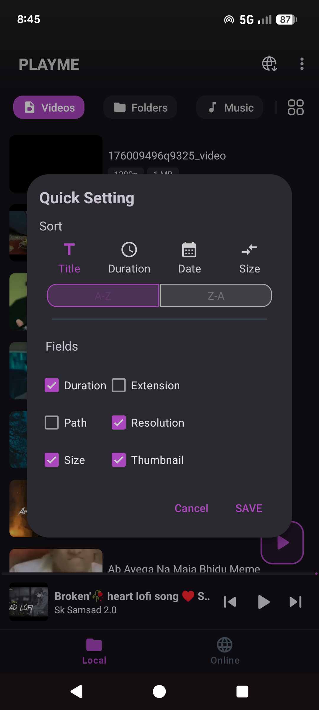
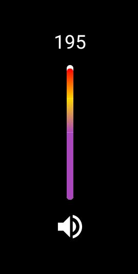

# 🎚️ Android Custom UI Widgets Collection

### **VerticalProgressBar • WaveSeekBar • CustomSeekBar**

A collection of beautifully crafted, highly customizable Android UI components written in Kotlin. These views are lightweight, smoothly animated, and designed for modern media apps such as video players, audio players, editing tools, and system-like sliders.

This repository contains three widgets:

* **CustomVerticalProgressBar** — Multi-color segmented vertical progress bar with gradients and configurable zones.
* **CustomSeekBar** — Minimal, featureful horizontal seekbar with optional dots and labels.
* **WaveSeekBar** — Animated waveform-style seekbar with many customization knobs.

---

# 🚀 What’s included

* Kotlin source files for each widget
* `res/values/attrs.xml` with all attributes (provided)
* Sample usage for XML and Kotlin
* Example app structure and sample Activity/Fragment snippets
* Guidance to add GIFs/screenshots and badges for GitHub
* Gradle module hints — how to package as a library

---

# 📋 Badges (copy to top of README)

```
[](./LICENSE)
[](#)
[](#)
[](#)
```

Place these directly under the main title in README.md.

---

# 📥 Installation / Copy

There are two simple integration options:

1. **Copy the Kotlin files** into your app module (quickest)

   * `app/src/main/java/com/hiitech/progressbar/CustomVerticalProgressBar.kt`
   * `app/src/main/java/com/hiitech/progressbar/CustomSeekBar.kt`
   * `app/src/main/java/com/hiitech/progressbar/WaveSeekBar.kt`
   * `app/src/main/res/values/attrs.xml` (attributes file — included)

2. **Make a Gradle library module** (recommended for reuse)

   * Create new module `:progressbar` and move sources/resources there.
   * Add `implementation project(":progressbar")` into app module.

---

# 🧩 attrs.xml (use the one you already have)

Paste your `attrs.xml` under `res/values/attrs.xml` — the file you shared is perfect. Example snippet (already included in your repo):

```xml
<?xml version="1.0" encoding="utf-8"?>
<resources>
    <declare-styleable name="CustomVerticalProgressBar"> ... </declare-styleable>
    <declare-styleable name="CustomSeekBar"> ... </declare-styleable>
    <declare-styleable name="WaveSeekBar"> ... </declare-styleable>
</resources>
```

(Full file is already present in your project.)

---

# 📘 Full README content (detailed)

> The sections below are intended to be the main content of `README.md`. Copy this whole document into your repo's README or keep it as a companion.

## Table of contents

* Features
* Quick start
* Widgets

  * CustomVerticalProgressBar
  * CustomSeekBar
  * WaveSeekBar
* Example app (code snippets)
* How to add GIFs/screenshots
* Gradle library packaging
* Contributing
* License

---

## ⭐ Features

* Works with both **XML** and **Kotlin**
* Highly customizable themeable attributes
* Smooth rendering & gradients
* XML `cvp_max` as initial default; Kotlin setters always override XML at runtime
* Lightweight: no extra libraries required

---

## 🔧 Quick start (XML + Kotlin)

1. Copy Kotlin files into package `com.hiitech.progressbar`.
2. Add `attrs.xml` into `res/values/`.
3. Use the views in layout XML and control them programmatically.

Example layout snippet:

```xml
<com.hiitech.progressbar.CustomVerticalProgressBar
    android:id="@+id/volumeProgress"
    android:layout_width="6dp"
    android:layout_height="150dp"
    app:cvp_max="100"
    app:cvp_backgroundColor="#FFFFFF"
    app:cvp_FirstColor="#7B3EFF"
    app:cvp_SecondColor="#FFEB3B"
    app:cvp_ThirdColor="#FF0000"
    app:cvp_FirstZonePercentage="0.5"
    app:cvp_SecondZonePercentage="0.25" />
```

Kotlin usage (Activity/Fragment):

```kotlin
binding.volumeProgress.maxValue = 200    // Kotlin override — wins at runtime
binding.volumeProgress.progressValue = 120
```

> Note: `cvp_max` in XML only sets the initial `maxValue`. Any subsequent calls from Kotlin (like `maxValue = 200`) override the XML value.

---

## 🔎 Widgets (detailed)

### CustomVerticalProgressBar

**Description**: Vertical track with three color zones (bottom → middle → top), gradient transitions and rounded corners. Useful for volume/brightness sliders.

**Key runtime properties (Kotlin)**

* `maxValue: Int` — total steps (default 32 fallback if XML not provided)
* `progressValue: Int` — current step (0..maxValue)

**XML attributes** — see `attrs.xml` table above.

**Behavior**

* If `maxValue <= 16`, the widget draws a flat purple fill (for brightness-style control).
* If `maxValue > 16`, widget divides the track into zones using `cvp_FirstZonePercentage` and `cvp_SecondZonePercentage`.
* XML `cvp_max` sets initial `maxValue`; Kotlin `maxValue = X` at runtime overrides XML.

---

### CustomSeekBar

**Description**: Lightweight horizontal seek bar with optional dots and labels. Use it when you want a simple styled seekbar that fits custom designs easily.

**Properties**: `progress`, `max` (or custom-named ones depending on your implementation), thumb size, colors.

---

### WaveSeekBar

**Description**: Animated waveform seekbar with configurable amplitude, wavelength, speed and thumb geometry. Great for audio visualizers and playful UIs.

**Behavior**: Set `wsb_enableWave` true to animate. The view exposes programmatic APIs to change wave amplitude, speed and progress.

---

## 📁 Example app

To help users quickly try the widgets, add a small sample app module in the repository.

**Project layout suggestion**:

```
/ (root)
  ├─ app/ (sample app)
  │    ├─ src/main/java/com/hiitech/demo/
  │    │     ├─ MainActivity.kt
  │    ├─ src/main/res/layout/activity_main.xml
  │    ├─ src/main/res/drawable/ (optional)
  ├─ progressbar/ (library module or just Kotlin files)
  ├─ README.md
  ├─ attrs.xml
  ├─ LICENSE
```

**Sample Activity (MainActivity.kt)**

```kotlin
class MainActivity : AppCompatActivity() {
    private lateinit var binding: ActivityMainBinding

    override fun onCreate(savedInstanceState: Bundle?) {
        super.onCreate(savedInstanceState)
        binding = ActivityMainBinding.inflate(layoutInflater)
        setContentView(binding.root)

        // XML initial max is 100 — override with Kotlin
        binding.volumeProgress.maxValue = 200
        binding.volumeProgress.progressValue = 80

        // WaveSeek usage
        binding.waveSeek.setOnTouchListener { v, event ->
            // handle gestures if you added touch support
            false
        }

        // Demo: animate progress
        binding.btnIncrease.setOnClickListener {
            binding.volumeProgress.progressValue = (binding.volumeProgress.progressValue + 5)
                .coerceAtMost(binding.volumeProgress.maxValue)
        }
    }
}
```

**Sample layout (activity_main.xml)**

```xml
<LinearLayout ... android:orientation="vertical">
    <com.hiitech.progressbar.CustomVerticalProgressBar
        android:id="@+id/volumeProgress"
        android:layout_width="8dp"
        android:layout_height="180dp"
        app:cvp_max="100" />

    <com.hiitech.progressbar.WaveSeekBar
        android:id="@+id/waveSeek"
        android:layout_width="match_parent"
        android:layout_height="80dp" />

    <Button android:id="@+id/btnIncrease" android:text="+5" ... />
</LinearLayout>
```

---

## 🖼️ GIF previews & screenshots (how to add)

1. Create a short screen recording (3–6s) showing each widget in action.
2. Convert to GIF (use ezgif.com or ffmpeg).
3. Add the GIF files to the repo, e.g. `assets/demo-vertical.gif`, `assets/demo-wave.gif`.
4. Reference them in README:

```markdown



assets/Screenshot_20251117-204521.png
```

**Pro tip**: Keep GIFs under 5–8 MB and crop to important area. For GitHub, PNG screenshots + one short GIF is usually best for performance.

---

## 🧪 Automated screenshot + GIF generation (optional)

You can add a small `tools/record` script or use CI to generate preview GIFs from the emulator, but that's optional.

---

## 📦 Gradle-ready library version

To package the widget set as a Gradle module (local module or AAR):

1. Create a new module: **File → New → New Module → Android Library** and name it `progressbar`.
2. Move the Kotlin files to `progressbar/src/main/java/...` and `attrs.xml` to `progressbar/src/main/res/values/attrs.xml`.
3. Edit `progressbar/build.gradle` (Kotlin DSL or Groovy) – keep minimal configuration:

```groovy
plugins {
    id 'com.android.library'
    id 'org.jetbrains.kotlin.android'
}

android {
    namespace 'com.hiitech.progressbar'
    compileSdk 34

    defaultConfig {
        minSdk 21
        targetSdk 34
    }
}

dependencies {
    implementation "org.jetbrains.kotlin:kotlin-stdlib:1.9.0"
}
```

4. In app module `build.gradle` add:

```groovy
implementation project(':progressbar')
```

5. Build → Generate AAR if you want to publish the library.

---

## 🧾 LICENSE

This project uses the MIT license. Add `LICENSE` file with the MIT text and keep `Copyright (c) YEAR YourName`.

---

## 🤝 Contributing

Contributions are welcome. Please open issues or PRs for features, bug fixes or performance improvements. Add a `CONTRIBUTING.md` if you want contribution guidelines.

---

## ✅ Checklist before publishing on GitHub

* [ ] Add screenshots & GIFs (assets/)
* [ ] Add LICENSE (MIT)
* [ ] Update README badges (CI / release)
* [ ] Add sample app and demo Activity
* [ ] Test on multiple devices & densities

---

## Contact

If you need help integrating or want me to generate the example app and GIFs for you, tell me which images/gifs you want and I will create the sample code and placeholders.

---

*Document generated for: CustomVerticalProgressBar, CustomSeekBar, WaveSeekBar*
