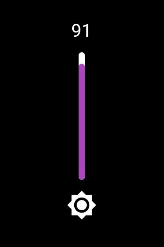
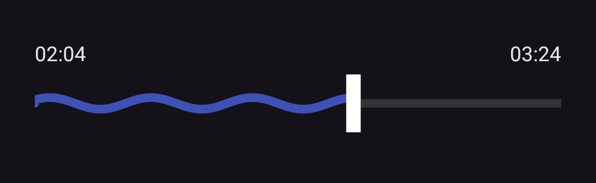
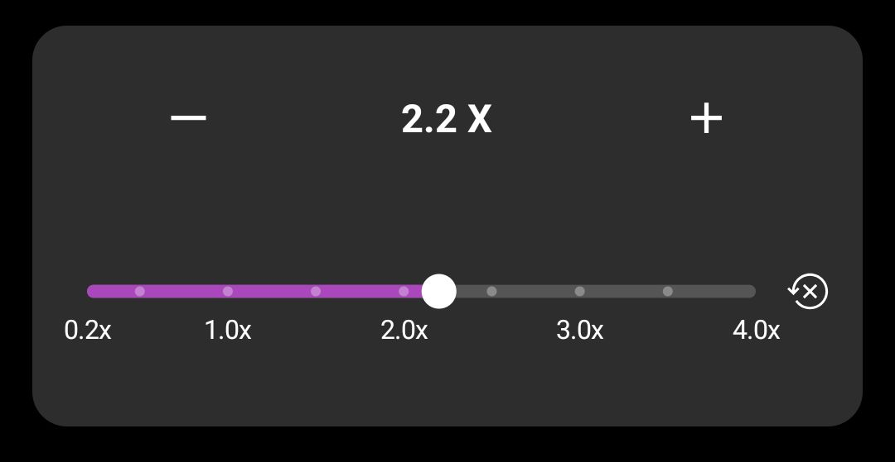

# 🎚️ Android Custom UI Widgets Collection

### **VerticalProgressBar • WaveSeekBar • CustomSeekBar**

A collection of beautifully crafted, highly customizable Android UI components written in Kotlin. These views are lightweight, smoothly animated, and designed for modern media apps such as video players, audio players, editing tools, and system-like sliders.

This repository contains three widgets:

* **CustomVerticalProgressBar** — Multi-color segmented vertical progress bar with gradients and configurable zones.
* **CustomSeekBar** — Minimal, featureful horizontal seekbar with optional dots and labels.
* **WaveSeekBar** — Animated waveform-style seekbar with many customization knobs.

---

# 🚀 What’s included

* custome wave progress bar like a13+ notification progress bar
* vertical progress bar 
* custom progress bar with text lebels

---

# 📋 Badges (copy to top of README)


[](./LICENSE)
[](#)
[](#)
[](#)


Place these directly under the main title in README.md.

---

# 📥 Installation

1. Add this in your root build.gradle at the end of repositories in allprojects section:
2. Then add this dependency to your module-level build.gradle in dependencies section:

 Step 2 Add it in your root settings.gradle at the end of repositories:
``` 
	dependencyResolutionManagement {
allprojects {
    repositories {
        maven { url 'https://jitpack.io' }
    }
}
```

 In app module `build.gradle` add:
 Step 2. Add the dependency
```
dependencies {
	        implementation 'com.github.hiitechcreations:verticalProgressBar:v2.6'
	}
```


# 📘 Full README content (detailed)

> The sections below are intended to be the main content of `README.md`. Copy this whole document into your repo's README or keep it as a companion.

## Table of contents

* Features
* Quick start
* Widgets

  * CustomVerticalProgressBar
  * CustomSeekBar
  * WaveSeekBar
* Example app (code snippets)
* How to add GIFs/screenshots
* Gradle library packaging
* Contributing
* License

---

## ⭐ Features

* Works with both **XML** and **Kotlin**
* Highly customizable themeable attributes
* Smooth rendering & gradients
* XML `cvp_max` as initial default; Kotlin setters always override XML at runtime
* Lightweight: no extra libraries required

---

## 🔧 Quick start (XML + Kotlin)

1. Copy Kotlin files into package `com.hiitech.progressbar`.
2. Add `attrs.xml` into `res/values/`.
3. Use the views in layout XML and control them programmatically.

Example layout snippet:

```xml
  <com.hiitech.progressbar.CustomVerticalProgressBar
            android:id="@+id/volumeProgress"
            android:layout_width="5dp"
            android:layout_height="100dp"
            app:cvp_backgroundLineWidth="5dp"
            app:cvp_backgroundColor="#FFFFFF"
            app:cvp_progressCornerRadius="8dp"
            app:cvp_zone1Threshold="100"
            app:cvp_zone2Threshold="150"
            app:cvp_zone1Color="?attr/colorPrimary"
            app:cvp_zone2Color="@color/yellow"
            app:cvp_zone3Color="@color/red" />
```

Kotlin usage (Activity/Fragment):

```kotlin
binding.volumeProgress.maxValue = 200    // Kotlin override — wins at runtime
binding.volumeProgress.progressValue = 120
```

> Note: `cvp_max` in XML only sets the initial `maxValue`. Any subsequent calls from Kotlin (like `maxValue = 200`) override the XML value.

---

## 🔎 Widgets (detailed)

### CustomVerticalProgressBar

**Description**: Vertical track with three color zones (bottom → middle → top), gradient transitions and rounded corners. Useful for volume/brightness sliders.

**Key runtime properties (Kotlin)**

* `maxValue: Int` — total steps (default 32 fallback if XML not provided)
* `progressValue: Int` — current step (0..maxValue)

**XML attributes** — see `attrs.xml` table above.

**Behavior**

* If `maxValue <= 16`, the widget draws a flat purple fill (for brightness-style control).
* If `maxValue > 16`, widget divides the track into zones using `cvp_FirstZonePercentage` and `cvp_SecondZonePercentage`.
* XML `cvp_max` sets initial `maxValue`; Kotlin `maxValue = X` at runtime overrides XML.

---

### CustomSeekBar

**Description**: Lightweight horizontal seek bar with optional dots and labels. Use it when you want a simple styled seekbar that fits custom designs easily.

**Properties**: `progress`, `max` (or custom-named ones depending on your implementation), thumb size, colors.

---

### WaveSeekBar

**Description**: Animated waveform seekbar with configurable amplitude, wavelength, speed and thumb geometry. Great for audio visualizers and playful UIs.

**Behavior**: Set `wsb_enableWave` true to animate. The view exposes programmatic APIs to change wave amplitude, speed and progress.

---

**Sample Activity (MainActivity.kt)**

```kotlin
class MainActivity : AppCompatActivity() {
    private lateinit var binding: ActivityMainBinding

    override fun onCreate(savedInstanceState: Bundle?) {
        super.onCreate(savedInstanceState)
        binding = ActivityMainBinding.inflate(layoutInflater)
        setContentView(binding.root)

        // XML initial max is 100 — override with Kotlin
        binding.volumeProgress.maxValue = 200
        binding.volumeProgress.progressValue = 80

        // WaveSeek usage
        binding.waveSeek.setOnTouchListener { v, event ->
            // handle gestures if you added touch support
            false
        }

        // Demo: animate progress
        binding.btnIncrease.setOnClickListener {
            binding.volumeProgress.progressValue = (binding.volumeProgress.progressValue + 5)
                .coerceAtMost(binding.volumeProgress.maxValue)
        }
    }
}
```

**Sample layout (activity_main.xml)**

```xml
<LinearLayout ... android:orientation="vertical">
      <com.hiitech.progressbar.CustomVerticalProgressBar
            android:id="@+id/volumeProgress"
            android:layout_width="5dp"
            android:layout_height="100dp"
            app:cvp_backgroundLineWidth="5dp"
            app:cvp_backgroundColor="#FFFFFF"
            app:cvp_progressCornerRadius="8dp"
            app:cvp_zone1Threshold="100"
            app:cvp_zone2Threshold="150"
            app:cvp_zone1Color="?attr/colorPrimary"
            app:cvp_zone2Color="@color/yellow"
            app:cvp_zone3Color="@color/red" />

    <com.hiitech.playme.WaveSeekBar
            android:id="@+id/audio_seekbar"
            android:layout_width="match_parent"
            android:layout_height="64dp"
            app:wsb_bgColor="@color/darker_grey"
            app:wsb_fgColor="@color/black"
            app:wsb_thumbColor="@color/black"
            app:wsb_strokeWidth="4dp"
            app:wsb_thumbWidth="16dp"
            app:wsb_thumbHeight="48dp"
            app:wsb_baseAmplitude="6"
            app:wsb_wavelength="90dp"
            app:wsb_waveEnabled="true"
            app:wsb_waveDuration="2500"
            app:wsb_max="200"
            app:wsb_progress="40"/>

  <com.hiitech.progressbar.CustomSeekBar
                android:id="@+id/customSeekBar"
                android:layout_width="0dp"
                android:layout_height="100dp"
                android:layout_weight="1"
                app:barColor="#555555"
                android:padding="5dp"
                app:progressColor="?attr/colorPrimary"
                app:thumbColor="#FFFFFF"
                app:textColor="#FFFFFF"
                app:dotColor="#FFFFFF"
                app:dotAlpha="80"
                app:barHeight="6dp"
                app:thumbRadius="8dp"
                app:textSize="12sp"
                app:showDots="true"
                app:showLabels="true" />

    <Button android:id="@+id/btnIncrease" android:text="+5" ... />
</LinearLayout>
```

---

## 🖼️ GIF previews & screenshots 





**More**: More customization available i can't show all things here 

---

## 🧾 LICENSE

This project uses the MIT license. Add `LICENSE` file with the MIT text and keep `Copyright (c) 2025 HiitechCreations`.

---

## 🤝 Contributing

Contributions are welcome. Please open issues or PRs for features, bug fixes or performance improvements.


## Contact

feel free to contact me 
